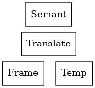

Modern Compiler Implementation in ML by A. Appel
================================================

https://www.cs.princeton.edu/~appel/modern/ml/

This book describes techniques, data structures, and algorithms for translating
programming languages into executable code.

The compiler is organised in phases, each operating on a different abstract
"language":

* Source Program -> Lex -> Tokens
* Parse -> Reductions
* Parsing Actions -> Abstract Syntax
* Semantic Analysis -> Translate (Tables -> Environments)
* Translate -> IR Trees (Frame -> Frame Layout)
* Canonicalise -> IR Trees
* Instruction Selection -> Assem
* Control Flow Analysis -> Flow Graph
* Data Flow Analysis -> Interference Graph
* Register Allocation -> Register Assignment
* Code Emission -> Assembly Language
* Assembler -> Relocatable Object Code
* Linker -> Machine Language

Description of compiler phases:

* **Lex:** Break the source file into individual works, or *tokens*
* **Parse:** Analyse the phrase structureof the program
* **Parsing Actions:** BUild a pice of *abstract syntax tree* corresponding to
  each phrase
* **Semantic Analysis:** Determine what each phrase means, relate uses of
  variables to their definitions, check types of expressions, request
  translation of each phrase
* **Frame Layout:** Place variables, function parameters, etc. into activation
  records (stack frames) in a machine-dependent way
* **Translate:** Produce *intermediate representation trees* (IR trees), a
  notation that is not tied to any particular source language or target machine
  architecture
* **Canonicalise:** Hoist side effects out of expressions, and clean up
  additional branches, for the convenience of the next phases
* **Instruction Selection:** Goup the IR-tree nodes into clumps that correspond
  to the actions of target-machine instructions
* **Control Flow Analysis:** Analyse the sequence of instructions into a
  *control flow graph* that shows all the possible flows of control the program
  might follow when it executes
* **Dataflow Analysis:** Gather information about the flow of information
  through variables of the program; for example, *liveness analysis* calculates
  the places where each program variable holds a still-needed value
* **Register Allocation:** Choose a register to hold each of the variables and
  temporary values used by the program; variables not live at the same time can
  share the same register
* **Code Emission:** Replace the temporary names in each machine instruction
  with machine registers

Usage
-----------

.. code-block:: bash

   dune exec ./bin/tigerc.exe

Layers of abstraction
---------------------

The Tiger compiler has two layers of abstraction between semantic analysis
and frame-layout details:



The ``Frame`` and ``Temp`` interfaces provide machine-independent views of
memory-resident and register-resident variables. The ``Translate`` module
augments this by handling the notion of nested scopes (via static links),
providing the interface ``Translate`` to the ``Semant`` module.

Activation Records (aka stack frames)
-------------------------------------

The area of the stack devoted to the local variables, parameter, return
address, and other temporaries for a function.

* Local variables created upon entry to the function
* Destroyed when a function returns
* LIFO: A function returns only after all the functions it has called have
  returned.

When a stack cannot hold local variables (higher-order functions):

It is the combination of *nested functions* (where inner functions may use
variables defined in the outer functions) and *functions returned as results*
(or stored in variables) that causes local variables to need lifetimes
longer than their enclosing function invocations.

Tiger treats the stack as a big array with a stack pointer.

The design of a frame layout takes into account the particular features of an
instruction set architecture and the programming language we are compiling.

The Frame Pointer
+++++++++++++++++

Suppose a caller g and a callee f. On entry to f, the stack pointer points to
the first argument that g passes to f. On entry, f allocates a frame by simply
subtracting the frame size from the stack pointer SP.

We save the FP in memory (in the frame) and the old SP becomes the new
frame pointer FP.

Tiger
-----

Some of the noteworthy language features:

Tiger is a simple but nontrivial language of the Algol family,
with nested scope and heap-allocated records.

It has two name spaces:

#. Types
#. Functions and variables

It supports nested function declarations where the inner scopes may access
variables in outer scopes (block structure), but it does not support
higher-order functions: the programmer cannot return functions as values
or store them in variables.

This implementation
+++++++++++++++++++

This implementation uses static links to implement nested function declarations.
Whenever we call a function f, we pass it a pointer to the stack frame of
the "current" (most recently entered) activation of the function g that
immediately encloses f in the text of the program.

Other options are:

* A display, or
* Lambda lifting

Development
-----------

Generate messages from Menhir:

.. code-block:: bash

  menhir --external-tokens Token --strict --explain --list-errors parser.mly > parser.messages

TODO
--------

#. Improve the parsing of ```&`` ``|`` and unary negation; The current approach in
   the AST will make it hard to provide quality error messages that relate
   to the source code.
#. Improve the treatment of escaped variables; It is currently hacked into
   the AST as an "escape" ref bool.
